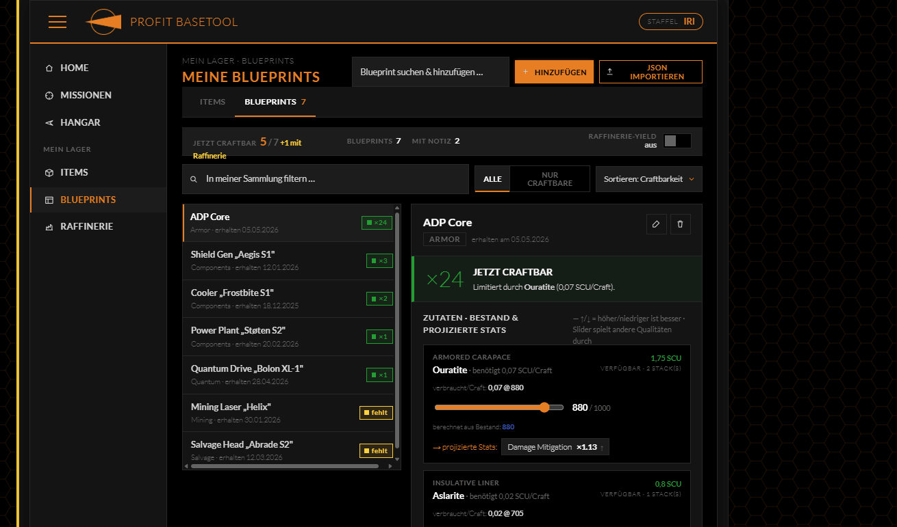
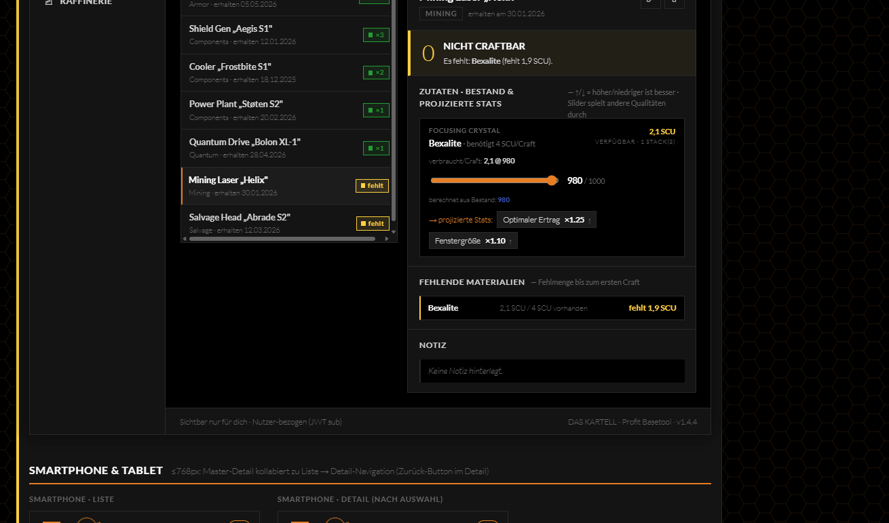
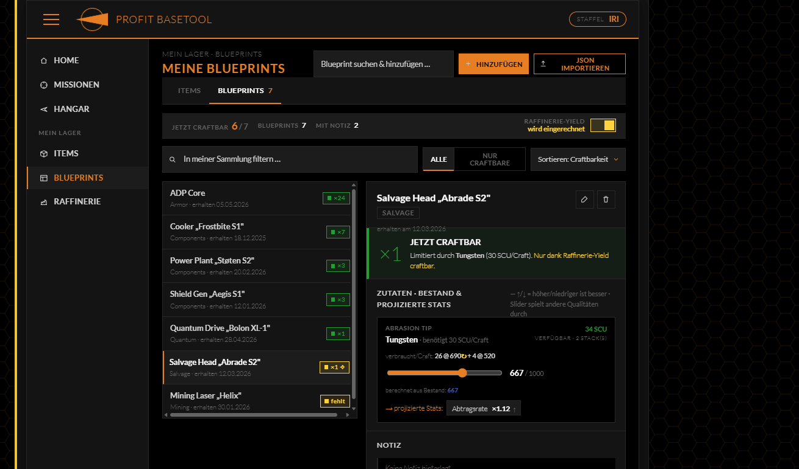
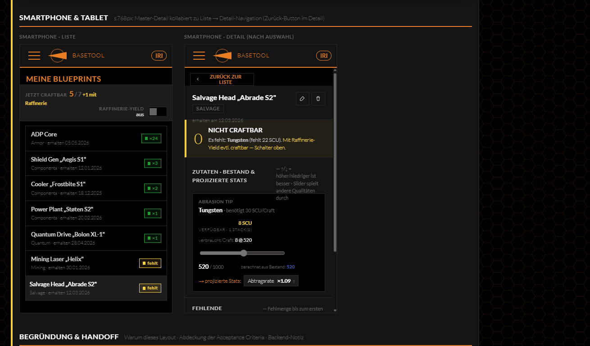

## Design-Vorschlag — Craftbarkeit in `/personal-inventory/blueprints`

Umsetzung im **Master-Detail-Layout (V3)** des DAS-KARTELL-Designsystems: dichte Blueprint-Liste links, permanente Craftability-Auswertung rechts. Die bisherige Seite beantwortet nur „welche Blueprints besitze ich" — dieses Design beantwortet zusätzlich die eigentliche Frage des Issues: *„Was kann ich JETZT craften, wie oft, mit welchen Output-Stats — und was fehlt mir?"*

> Interaktiver Prototyp (Standalone-HTML, offline lauffähig) ist als Datei angehängt: **`blueprints-craftability-781.standalone.html`**. Filter, Sortierung, Refinery-Toggle und Qualitäts-Slider sind live.

### Screenshots

**Desktop — craftbar (Refinery aus)**


**Desktop — nicht craftbar + Fehlbestand-Aufschlüsselung**


**Desktop — Refinery-Yield eingerechnet (5 → 6 craftbar; „×1 ⟢" = nur dank Raffinerie)**


**Smartphone — Liste → Detail-Kollaps mit Zurück-Button**


### Warum Master-Detail (V3)

- **#781 macht jeden Blueprint inhaltsreich** (Craftbar-Zähler, projizierte Stats je Zutat-Qualität, Verbrauchs-Aufschlüsselung, Fehlbestand) — das passt nicht mehr in eine Tabellenzeile/Karte; die permanente Detail-Spalte zeigt alles ohne Klickorgie.
- **Liste bleibt dicht & scanbar:** Craft-Status je Zeile (`×N` grün / `fehlt` gelb / `×N ⟢` = nur via Raffinerie) — die Kernfrage „was geht jetzt?" ist schon in der Liste beantwortet.
- **Eine Aktion pro Kontext:** Orange bleibt für „Hinzufügen" (CTA); Craftbarkeit nutzt Status-Grün/Warn-Gelb, Qualität nutzt Forschungs-Blau als Rechen-Akzent — keine Akzent-Überladung.
- **Responsive:** kollabiert ≤768px sauber zu Liste → Detail (Zurück-Button), Touch-Ziele ≥44px.

### Abdeckung der Acceptance Criteria

- [x] Craftbar-Anzeige je Blueprint, RESOURCE-Zutaten **über alle Lagerorte gepoolt**
- [x] Zähler `N = ⌊min(verfügbar / benötigt)⌋`, limitierende Zutat benannt
- [x] **Effektive Qualität** beste-Stacks-zuerst, SCU-gewichtet → projizierte Output-Stats über das Modifier-Modell (linear; gestufte `segments` vorgesehen). Optionaler Slider spielt andere Qualitäten durch.
- [x] Nicht-craftbare BPs listen **fehlendes Material + Fehlmenge in SCU**
- [x] **Refinery-Toggle** (default AUS) faltet Yield aus `OPEN`+`IN_PROGRESS` ein, bewertet alles neu, inkl. Qualitätsbeitrag
- [x] **ITEM**-Zutaten sichtbar, klar „nicht bewertet" (v1 out of scope)
- [x] Streng nutzer-bezogen (JWT `sub`); de/en/Fallback i18n; responsive über alle vier Geräteklassen

### Backend-Notiz (read-only, keine Migration)

```
GET /api/v1/personal-blueprints/craftability?includeRefinery={false|true}
```

- **Quellen:** `PersonalBlueprint` → `BlueprintProductService`/`BlueprintIngredient` · Bestand `InventoryItem` (user == me) · Yield `RefineryGood` (OPEN/IN_PROGRESS)
- **Stats:** `BlueprintRequirementModifier` — interpolieren `modifierAtMinQuality…modifierAtMaxQuality` über `qualityMin…qualityMax`, gestufte `segments` honorieren
- Neue DTO(s) → `openapi.json` + SpringDoc; Frontend-Call mit Resilience4j umhüllt wie jeder Backend-Call

---

<sub>Design erstellt im DAS-KARTELL-Designsystem (Lato, House-Orange `#E77E23`, HUD-Patterns: `.master-detail`, `.quality-block`, `.facts-bar`, `.chip`). Die Demo-Werte im Prototyp bilden die Issue-Logik 1:1 nach.</sub>
